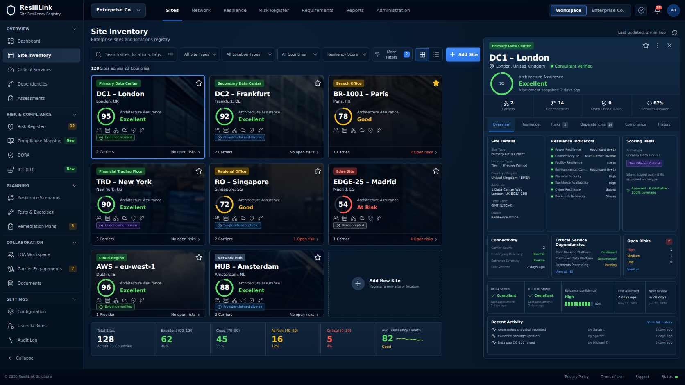
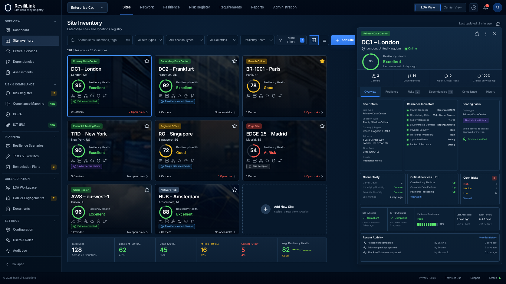

# IDA — Infrastructure Dependency Assurance

A working React/TypeScript prototype and enterprise code spine for a consultancy-operated **Site Resiliency Registry**. The consultancy operates under enterprise Letters of Authorization to collect carrier evidence, model L1–L3 and cloud dependencies, score site resilience, maintain a traceable risk registry, and map neutral controls to DORA/ICT-oriented requirements.

The current interface label **ResiliLink** is intentionally retained as the working product name so repository setup does not alter the approved screen.

## Approved visual contract

The interface is implemented as accessible React/DOM components. The screenshot is **not** used as a page background or flattened interaction layer.

### Binding product reference



### Current code-generated implementation



The approved reference is the product authority. `docs/UI_LOCK.md`, the 1672 × 941 Playwright baseline, immutable reference checksum, visual-token checks, and Codex instructions protect the dark navy console, compact density, card imagery, score rings, evidence states, KPI strip, and right-side inspector from redesign drift.

## Start here

Read [`00_START_HERE.md`](00_START_HERE.md).

Use Node 22.12 or newer:

```bash
npm ci
npm run check
npm run dev
```

Open:

```text
http://localhost:4173/?site=site-dc1-london&tab=overview&view=grid&mode=loa
```

For the browser-level regression suite:

```bash
npx playwright install --with-deps chromium
npm run test:e2e
```

## Implemented prototype behavior

- Locked 1672 × 941 Site Inventory composition
- 51 px top navigation and 204 px left navigation rail
- Three-column site-card registry with site photography
- 480 px inset site-detail inspector
- Eight canonical sites plus Add Site
- Search and multi-dimensional filtering
- Grid/list view switching
- Site selection with URL-restorable state
- Detail tabs for overview, resilience, risks, dependencies, compliance, and history
- Favorite state and closeable detail pane
- Validated Add Site flow with archetype-aware score preview
- Explicit **single-site acceptable** handling with no artificial diversity penalty
- Risk acceptance retained separately from technical health
- LOA Workspace and carrier-request prototype
- Requirement-mapping prototype
- Typed domain models, repository port, scoring engine, unit tests, E2E tests, and visual regression baseline

## Enterprise code spine

```text
src/
├── application/       UI use cases and registry state
├── components/        Locked reusable presentation components
├── data/              Canonical prototype fixtures
├── domain/            Pure entities and versioned scoring rules
├── features/          LOA and requirements modules
├── infrastructure/    Repository ports and prototype adapters
└── styles/            Locked geometry and design tokens
```

Supporting production contracts include:

- `database/core-schema.sql` — PostgreSQL/PostGIS multi-tenant schema starter
- `contracts/openapi.yaml` — authenticated API contract starter
- `docs/ENTERPRISE_SCALE_PLAN.md` — scale and service decomposition plan
- `docs/SECURITY_AND_TENANCY.md` — authorization and isolation model
- `prompts/` — ordered Codex implementation specifications
- `.github/workflows/` — CI, visual testing, and optional Pages preview deployment

## Critical domain separation

- Technical health is not evidence confidence.
- Risk acceptance does not improve the technical score.
- An approved single-site design is not penalized simply for having one carrier or path.
- Contracted carrier, underlying carrier, access provider, and managed provider remain separate records.
- Carrier collaboration requires an active, scoped, unexpired, unrevoked LOA.
- DORA, ICT, NIS2, ISO, customer, and contractual requirements map to a neutral control model; the UI does not make a legal compliance determination.

## Codex continuation

Codex must read these before editing:

1. `AGENTS.md`
2. `CODEX_HANDOFF.md`
3. `docs/UI_LOCK.md`
4. `docs/reference-site-inventory.png`
5. `prompts/00_MASTER_AGENT_CONTRACT.md`
6. the relevant numbered phase prompt

Use [`CODEX_FIRST_TASK.md`](CODEX_FIRST_TASK.md) as the first connected-repository task. Do not ask Codex to recreate or modernize the existing screen.

## Prototype boundary

The repository is ready for continued engineering, demonstrations, and controlled deployment. It is not yet authorized to hold production enterprise or carrier data or to make legal claims of DORA/ICT compliance. Production requires authenticated services, tenant isolation, evidence storage, audit controls, secrets management, monitoring, retention, recovery, and security review.
